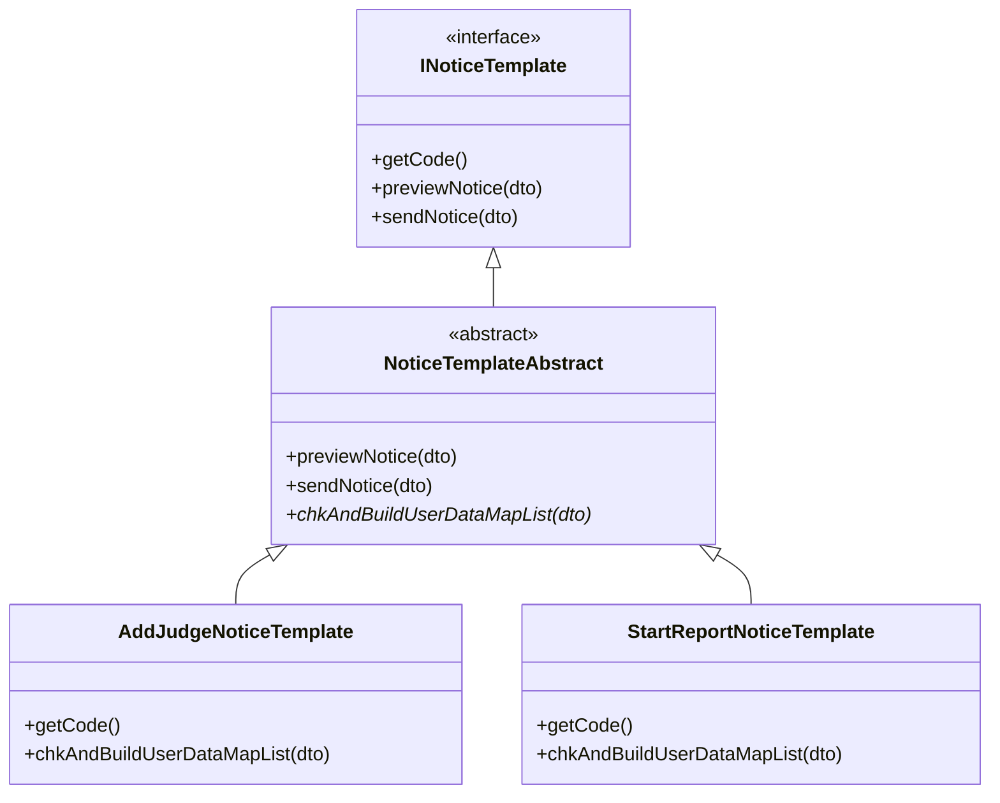

# 策略模式与模板方法：为什么它们总是一起出现

发通知几乎每个系统都有，也几乎都会踩同一个坑：通知类型越加越多，每种类型的数据来源和拼装逻辑都不一样，但"查数据、拼消息、发出去"这个流程骨架又都差不多。于是代码慢慢长成 if/else 按类型分发，每加一种类型就要改一次老方法，预览和发送还得各写一遍。

我负责的项目里就有一个这样的通知模块。后来我用策略模式加模板方法把它重构成三件套结构，新增一种通知从"改一个 200 行的老方法"变成"新建一个 30 行的类"。这篇文章讲清楚这两个模式为什么总是一起出现，以及它们各自解决什么问题。

## 策略模式：把"怎么做"变成可替换的单元

策略模式解决的是"一类事情有多种做法"。它把每种做法封装成独立类，让调用方只面向一个统一的接口，运行时要哪种就用哪种。

我们模块里的策略接口长这样：

```java
public interface INoticeTemplate {
    // 策略的唯一标识，注册和查找都用它
    String getCode();

    // 生成预览数据
    PreviewNoticeVO previewNotice(PreviewNoticeDTO dto);

    // 发送消息
    <T> T sendNotice(PreviewNoticeDTO dto);
}
```

每种通知实现这个接口，就是一个具体策略。调用方手里拿着的是 `INoticeTemplate`，根本不关心背后是哪一种通知。

策略模式最大的收益是开闭原则：新增一种通知只需要新增一个实现类，已有的类和调用代码一行都不用动。它把"变化"从判断逻辑里剥离了出来，让"加类型"不再撬动老代码。

它也有自己的边界。如果整个系统只有两三种通知，每种就几行逻辑，if/else 反而更直白。策略模式的价值在"类型会持续增长"的场景，那时每加一种类型都在改老代码，才是它出手的时候。

## 模板方法模式：把"流程"固化在骨架里

策略模式解决了"有哪几种做法"，但还没解决另一个问题：这些做法的内部流程几乎一模一样。每种通知都要"校验参数、查数据、拼变量、渲染、发送"，只有中间"查数据拼变量"这一步不同。如果每个策略类都把完整流程抄一遍，重复代码会以"每个类一份"的方式重新长回来。

模板方法模式就是为这个场景准备的。它把不变的流程写死在抽象基类里，把变化的那一步留成抽象方法，交给子类实现。我们项目里的抽象基类大概是这个样子（略去了细节）：

```java
public abstract class NoticeTemplateAbstract implements INoticeTemplate {

    @Override
    public PreviewNoticeVO previewNotice(PreviewNoticeDTO dto) {
        // 骨架第一步：让子类去查数据、拼变量
        List<Map<String, Object>> maps = chkAndBuildUserDataMapList(dto);
        // 骨架第二步：统一的渲染逻辑
        return genAnyPreviewNoticeVo(dto.getTitle(), dto.getContent(), maps);
    }

    @Override
    public <T> T sendNotice(PreviewNoticeDTO dto) {
        List<Map<String, Object>> maps = chkAndBuildUserDataMapList(dto);
        messageService.sendMessageByContent(getCode(), dto.getTitle(), dto.getContent(), maps);
        return (T) Boolean.TRUE;
    }

    // 变化点：数据从哪来、变量怎么拼，由每种通知自己实现
    public abstract List<Map<String, Object>> chkAndBuildUserDataMapList(PreviewNoticeDTO dto);
}
```

"校验、构建、渲染、发送"这些步骤被收进了骨架，子类只负责填 `chkAndBuildUserDataMapList` 这一个空。预览和发送是两套入口，但共享同一个查数逻辑，这顺带解决了一个隐患：预览看到的内容和实际发送的内容永远一致。

骨架还可以留"钩子"，让流程在特定节点被子类改写。我们项目里有一个变体骨架，把抽象方法升级成带 `isSend` 参数：预览时传 false，发送时传 true。有些通知发送前要落库、改状态，而预览时不能产生这些副作用，钩子正好让同一个类在两种场景下走不同的分支。

## 两个模式如何咬合

现在回到最开始的问题：为什么这两个模式总是一起出现？

因为它们解决的是同一个问题的两个不同层。策略模式管"系统里有哪几种实现，运行时选哪个"；模板方法管"某个实现内部的流程怎么复用"。现实中的"同类不同实现"，几乎总是同时带着这两层需求：类型很多，需要策略来组织；每个类型又有相似流程，需要模板方法来去重。

两个模式在同一个类上汇合。一个具体通知类同时扮演两个角色：它是被选中的"策略"，也是复用骨架的"子类"。三层结构长这样：



最顶层的接口定义"能力"，中间的抽象类实现接口并固定"流程"，最底层的每个具体类只写"自己的数据从哪来"。新增一种通知，就是在最底层加一个类，上面两层完全不动。

## 配角：怎么拿到想要的策略

策略模式本身没有回答"运行时怎么选到目标策略"。实践中需要一个取用机制，最简单的办法是给每个策略一个唯一 code，用一个 map 存起来。

Spring 里最省事的做法，是让工厂在构造时把容器里所有策略实现自动收集进来。`INoticeTemplate` 的所有实现类都是 Spring bean，所以直接在构造器里注入 `List<INoticeTemplate>`，Spring 会把它们全部收集好送过来：

```java
@Component
public class NoticeTemplateFactory {

    private final Map<String, INoticeTemplate> templateMap;

    public NoticeTemplateFactory(List<INoticeTemplate> templates) {
        templateMap = templates.stream()
                .collect(Collectors.toMap(INoticeTemplate::getCode, t -> t));
    }

    public INoticeTemplate getTemplate(String code) {
        Assert.isTrue(templateMap.containsKey(code), "不支持的模板类型：" + code);
        return templateMap.get(code);
    }
}
```

注册逻辑整个收进了工厂构造器，且集中在工厂这一处。调用方最后就一行：

```java
noticeTemplateFactory.getTemplate(code).sendNotice(dto);
```

这里有个容易想到的替代方案，值得对比：让每个策略在初始化时把自己注册进工厂（比如 `@PostConstruct` 里调一个 register 方法）。它也能工作，但策略类因此要感知工厂的存在，注册行为散落在每个策略里。用构造器注入收集，策略类对工厂一无所知，注册集中在一个地方，职责更干净。唯一的前提是策略得是 Spring 管理的 bean，这在 Spring 项目里是默认成立的。

说句公道话，这个工厂在整个设计里是配角。没有它，直接在业务代码里注入 `List<INoticeTemplate>` 再自己找，效果也差不多，策略加模板方法这对组合的核心思想跟工厂无关。我单独把它拎出来讲，是因为"策略模式落地时总要有个取用机制"，而这是代码量最小、最 Spring 味的一种。

## 代价：不是什么场景都该用

这套组合不是免费的。代价主要有三个：类数量随类型数增长，每个类型一个文件；多了一层间接，读代码要沿着"接口→基类→子类"走三个文件；理解成本高，新人第一次看会困惑为什么搞这么绕。

所以我的判断标准很直接。当你的代码同时出现三个信号，才值得用：同类实现超过三五个，每个实现内部都有一截相似的流程，而且运行时要按标识动态选择。满足这三点，策略加模板方法的收益才覆盖得住成本。只有一两个实现的小系统，if/else 就是正确的选择，硬套模式只会让简单的事情变复杂。

## 总结

三个模式各归其位：策略模式回答"有哪几种做法"，模板方法回答"一种做法内部的流程怎么复用"，工厂回答"我要的是哪一种"。策略管外部，模板方法管内部，工厂做辅助。

如果你手上也有一坨 if/else 分发的代码，而且正在为"加一种类型要动老代码"头疼，可以试着按"接口 + 抽象骨架 + 具体实现"三层重写一遍。重写完你会直观地感受到一件事：以后再新增类型，你只需要新建一个文件，然后心平气和地收工。